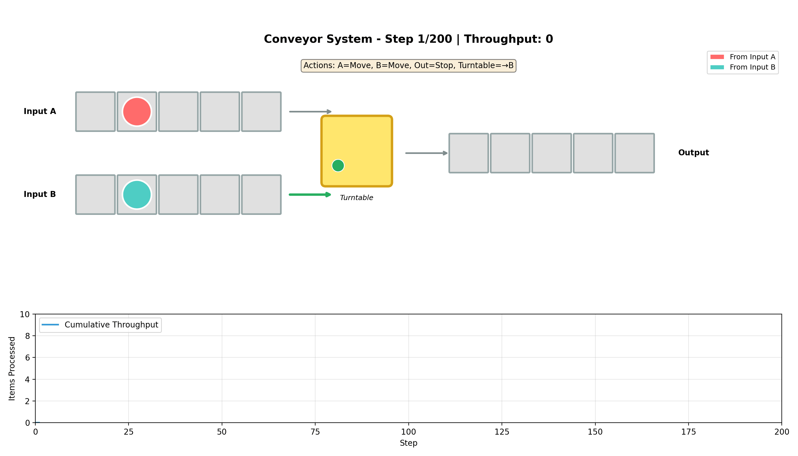
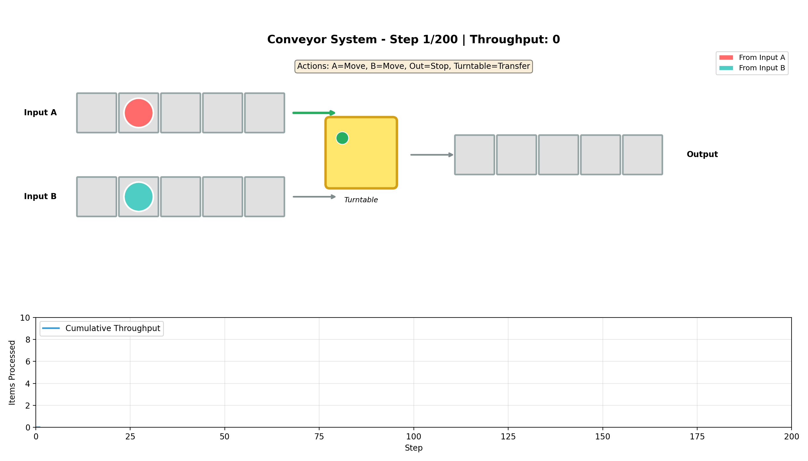
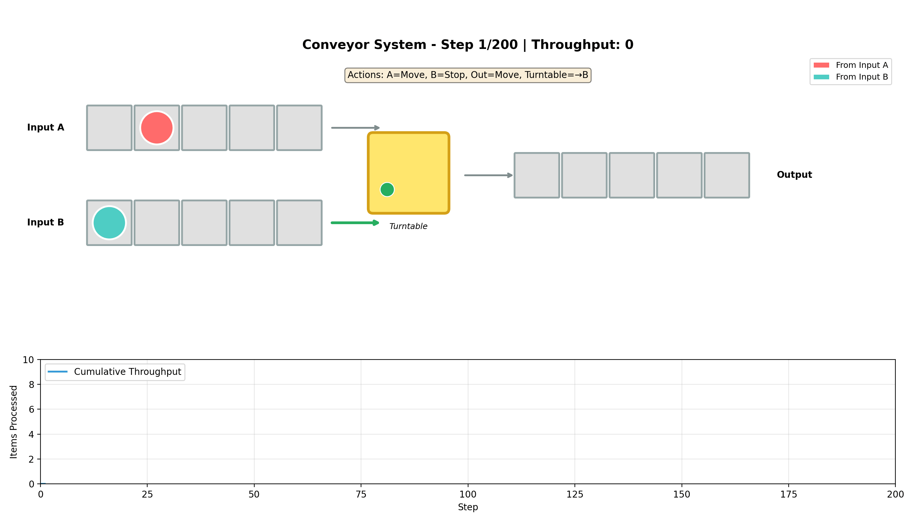
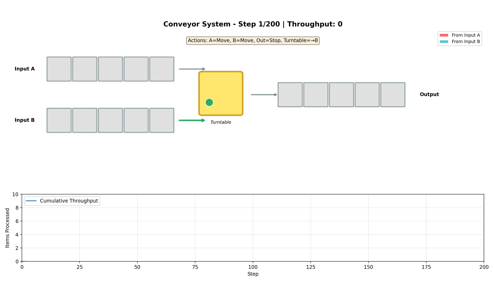

# Conveyor System RL - Zipper Merge Learning

A reinforcement learning project that trains an AI agent to efficiently manage a 3-way conveyor system with two inputs merging through a turntable to one output. The agent learns to maximize throughput while discovering emergent behaviors like the **zipper merge** pattern.

## Demo

### Trained Policy - Zipper Merge Behavior


The trained agent learns to alternate between input sources (A and B), creating an efficient zipper merge pattern that maximizes throughput.

### Policy Comparison

| Trained Policy | Random Policy |
|:--------------:|:-------------:|
|  |  |

The trained policy achieves significantly higher throughput and zipper ratio compared to random actions.

## Project Overview

### Environment

```
Input A [4][3][2][1][0] →
                          [Turntable] → [0][1][2][3][4] Output
Input B [4][3][2][1][0] →
```

- **Two input conveyors** (A and B) feed items toward a central turntable
- **Turntable** can connect to either input and transfer items to output
- **Output conveyor** carries items to the exit point
- Items spawn randomly on input conveyors based on configurable spawn rates

### Reward Structure

| Event | Reward |
|-------|--------|
| Item exits output conveyor | +1.0 |
| Source alternation (zipper) | +2.0 |
| Same source consecutively | -0.5 * consecutive_count |
| Blocking (item waiting, wrong turntable direction) | -0.05 |

### Action Space

The agent controls 4 discrete actions per step:

| Action | Values |
|--------|--------|
| Conveyor A | 0=Stop, 1=Move |
| Conveyor B | 0=Stop, 1=Move |
| Output Conveyor | 0=Stop, 1=Move |
| Turntable | 0=Connect A, 1=Connect B, 2=Transfer to Output |

## Installation

### Prerequisites

- Python 3.8+
- pip

### Setup

```bash
# Clone the repository
git clone https://github.com/yourusername/conveyor_rl.git
cd conveyor_rl

# Create virtual environment (recommended)
python -m venv venv
source venv/bin/activate  # On Windows: venv\Scripts\activate

# Install dependencies
pip install -r requirements.txt
```

### Dependencies

- `gymnasium>=0.29.0` - RL environment framework
- `stable-baselines3>=2.0.0` - PPO algorithm implementation
- `numpy>=1.24.0` - Numerical computing
- `matplotlib>=3.7.0` - Visualization
- `pillow>=9.0.0` - GIF generation

## Usage

### Quick Start - Demo Mode

Run a quick demo that trains for 50k steps and generates visualizations:

```bash
python run.py demo
```

This will:
1. Train a model for 50,000 timesteps
2. Evaluate the trained model
3. Generate `demo_rollout.gif`
4. Create comparison visualizations in `demo_comparison/`

### Full Training

Train a model with the default 500k timesteps:

```bash
python run.py train
```

Customize training parameters:

```bash
python run.py train --timesteps 1000000 --n-envs 16
```

| Parameter | Default | Description |
|-----------|---------|-------------|
| `--timesteps` | 500,000 | Total training timesteps |
| `--n-envs` | 8 | Number of parallel environments |

### Visualization

Generate a visualization of a trained policy:

```bash
python run.py visualize --model models/conveyor_ppo_final
```

Options:

```bash
python run.py visualize --model models/conveyor_ppo_final --output my_rollout.gif --steps 300 --fps 6
```

| Parameter | Default | Description |
|-----------|---------|-------------|
| `--model` | models/conveyor_ppo_final | Path to trained model |
| `--output` | rollout.gif | Output file path |
| `--steps` | 200 | Simulation steps |
| `--fps` | 4 | Animation frames per second |

### Compare Policies

Compare a trained policy against random actions:

```bash
python run.py compare --model models/conveyor_ppo_final
```

This generates two GIFs in the `comparisons/` directory:
- `trained_policy.gif` - Trained agent behavior
- `random_policy.gif` - Random action baseline

### Evaluate Model

Run evaluation episodes and print statistics:

```bash
python run.py evaluate --model models/conveyor_ppo_final --episodes 20
```

## Project Structure

```
conveyor_rl/
├── run.py              # Main entry point with CLI commands
├── environment.py      # Zipper-merge Gymnasium environment
├── network_env.py      # Graph conveyor network environment
├── network_graphs.py   # Preset / JSON graph definitions
├── train.py            # PPO training (zipper merge)
├── train_network.py    # PPO training (network throughput)
├── visualize.py        # Zipper-merge visualization
├── visualize_network.py# Network graph visualization
├── graphs/             # Example custom graph JSON files
├── requirements.txt    # Python dependencies
├── models/             # Saved model checkpoints
│   ├── best/           # Best model during training
│   ├── checkpoints/    # Periodic checkpoints
│   └── conveyor_ppo_final.zip
├── logs/               # TensorBoard logs
├── comparisons/        # Policy comparison GIFs
└── *.gif               # Generated visualizations
```

## Understanding the Visualizations

### Main Display



- **Red circles**: Items from Input A
- **Teal circles**: Items from Input B
- **Yellow box**: Turntable (green dot shows active connection)
- **Gray boxes**: Empty conveyor positions
- **Bottom graph**: Cumulative throughput over time

### Action Display

The top of each frame shows the current actions:
- `A=Move/Stop` - Input A conveyor movement
- `B=Move/Stop` - Input B conveyor movement
- `Out=Move/Stop` - Output conveyor movement
- `Turntable=→A/→B/Transfer` - Turntable connection or transfer action

## Training Details

### Algorithm

The project uses **Proximal Policy Optimization (PPO)** from Stable-Baselines3:

| Hyperparameter | Value |
|----------------|-------|
| Learning Rate | 3e-4 |
| Batch Size | 64 |
| N Steps | 2048 |
| N Epochs | 10 |
| Gamma | 0.99 |
| GAE Lambda | 0.95 |
| Clip Range | 0.2 |
| Entropy Coefficient | 0.01 |
| Network Architecture | MLP [64, 64] |

### Monitoring Training

Training logs are saved for TensorBoard:

```bash
tensorboard --logdir logs
```

## Key Metrics

After training, the model is evaluated on:

- **Throughput**: Total items successfully processed
- **Zipper Ratio**: Percentage of source alternations (100% = perfect zipper)
- **Mean Reward**: Average episode reward

Example evaluation output:
```
Evaluation over 10 episodes:
  Mean reward: 245.32
  Mean throughput: 67.8
  Mean zipper ratio: 82.5%
  Max throughput: 73
  Min throughput: 61
```

## Customization

### Environment Parameters

Modify `environment.py` or pass kwargs when creating the environment:

```python
env = ConveyorEnv(
    conveyor_length=5,      # Length of each conveyor
    spawn_rate_a=0.8,       # Item spawn probability for A
    spawn_rate_b=0.8,       # Item spawn probability for B
    max_steps=200,          # Episode length
    zipper_bonus=2.0,       # Reward for alternating sources
    consecutive_penalty=0.5 # Penalty multiplier for same source
)
```

### Training Parameters

Modify `train.py` to adjust PPO hyperparameters or network architecture.

## Conveyor Network Graphs (throughput)

Besides the fixed zipper-merge layout, you can define a **graph of conveyors** and train a small policy to maximize throughput.

### Graph model

| Element | Role |
|---------|------|
| **Source** node | Spawns items onto outbound belts (`spawn_rate`) |
| **Junction** node | Holds one item; agent chooses which inbound to pull and which outbound to push |
| **Sink** node | Items exiting here score **+1 throughput** |
| **Edge** | Conveyor of fixed `length`; agent can move or stop each belt |

Reward is throughput-first (`+1` per sink exit) with a small optional congestion penalty.

### Built-in presets

| Preset | Topology |
|--------|----------|
| `merge` | Two sources → junction → sink |
| `diamond` | Source → split → two parallel paths → merge → sink |
| `triple` | Three sources → junction → sink |

### Quick network demo

```bash
python run.py network-demo --preset merge
# or
python run.py network-demo --preset diamond --timesteps 20000
```

This trains a compact PPO policy (`[32, 32]` MLP), evaluates against a random baseline, and writes `network_demo.gif`.

### Custom graphs

Edit or copy JSON under `graphs/`:

```json
{
  "name": "custom_merge",
  "nodes": [
    {"id": "src_a", "type": "source", "spawn_rate": 0.7},
    {"id": "src_b", "type": "source", "spawn_rate": 0.7},
    {"id": "merge", "type": "junction"},
    {"id": "sink", "type": "sink"}
  ],
  "edges": [
    {"id": "conv_a", "source": "src_a", "target": "merge", "length": 4},
    {"id": "conv_b", "source": "src_b", "target": "merge", "length": 4},
    {"id": "conv_out", "source": "merge", "target": "sink", "length": 4}
  ]
}
```

Train / evaluate / visualize:

```bash
python run.py network-train --graph graphs/custom_merge.json --timesteps 30000
python run.py network-evaluate --graph graphs/custom_merge.json --model models/network/network_ppo_final --baseline
python run.py network-visualize --graph graphs/custom_merge.json --output /tmp/network.gif
```

### Network modules

| File | Purpose |
|------|---------|
| `network_graphs.py` | Presets, JSON load/validate |
| `network_env.py` | `NetworkConveyorEnv` Gymnasium environment |
| `train_network.py` | Small-policy PPO training + eval |
| `visualize_network.py` | Graph rollout GIF |

## License

MIT License

## Acknowledgments

- [Stable-Baselines3](https://github.com/DLR-RM/stable-baselines3) for the PPO implementation
- [Gymnasium](https://github.com/Farama-Foundation/Gymnasium) for the RL environment framework
